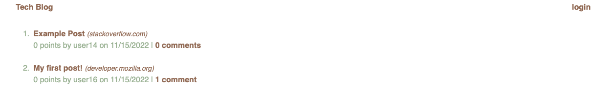
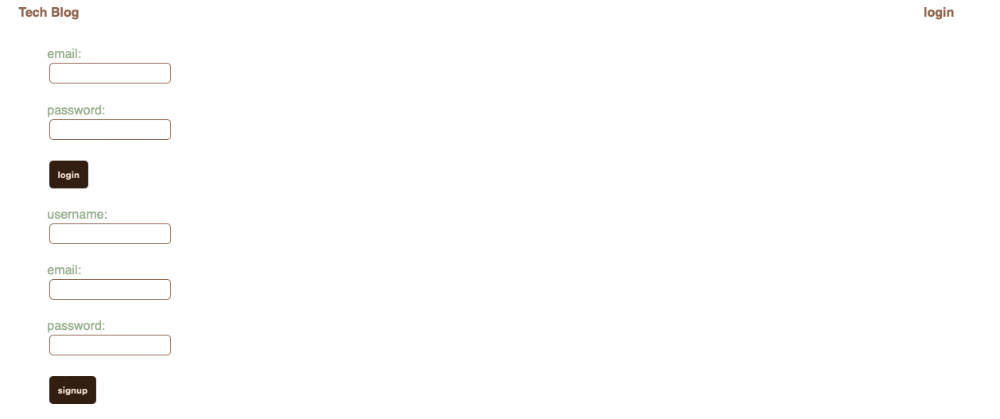
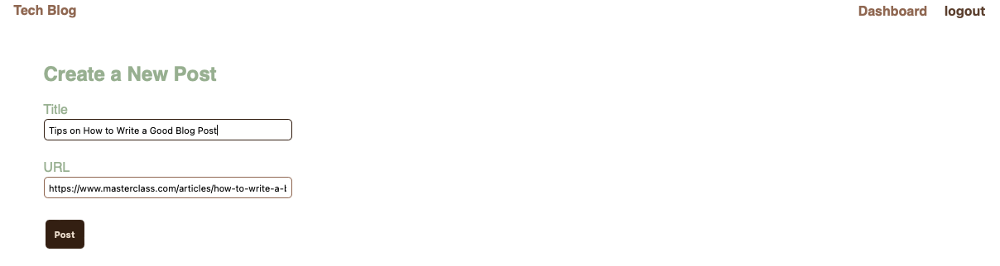
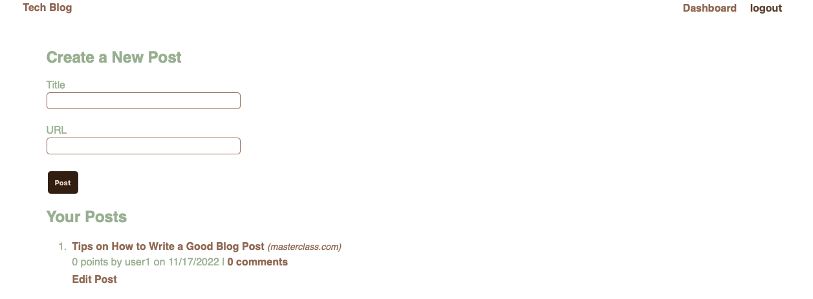
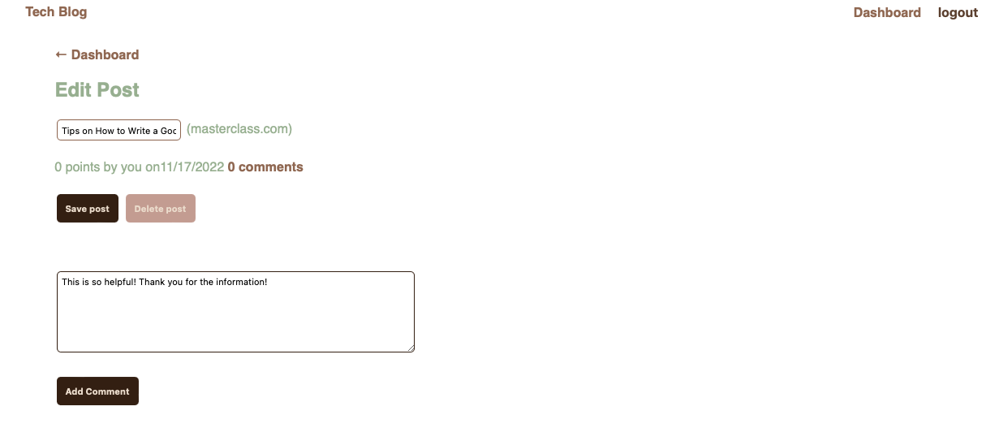
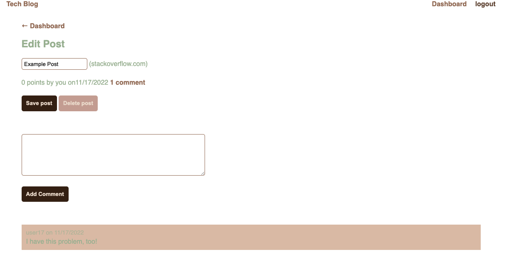
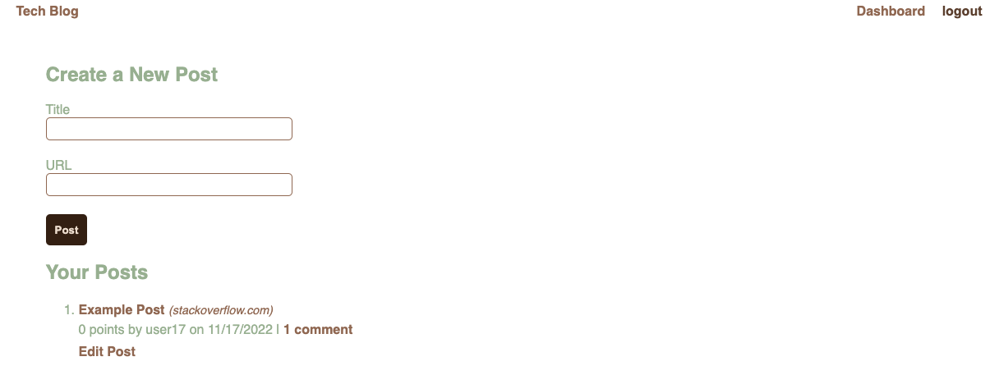
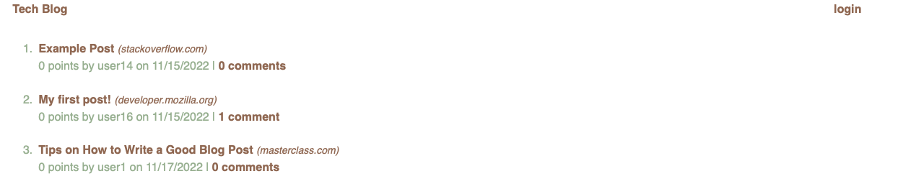
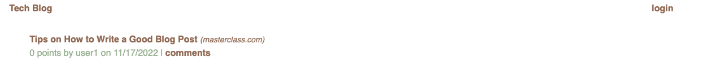

# fates-shared-eye

## Description 
This application is a tech blog website designed for the user to make posts about issues they are having, successes they have achieved, and allow other users to comment on these issues. 

## Table of Contents

[Installation](#installation)
[Usage](#usage)
[Future Iterations](#future-iterations)
[License](#license)

## Installation 
In order for this application to work, the user will need to install the <a href="https://expressjs.com/en/starter/installing.html">Express</a>, <a href="https://www.npmjs.com/package/express-handlebars">Express Handlebars</a>, <a href="https://www.npmjs.com/package/express-session">Express session</a>, <a href="https://www.npmjs.com/package/mysql2">MySQL2</a>, <a href="https://www.npmjs.com/package/sequelize">Sequelize</a>, and <a href="https://www.npmjs.com/package/connect-session-sequelize">connect-session-sequelize</a> packages. The user will also need to install <a href="https://www.npmjs.com/package/dotenv">dotenv</a> and <a href="https://www.npmjs.com/package/bcrypt">bcrypt</a> to hide sensitve information like the database password.

## Usage

First, the user will open the terminal and navigate to the application.  
Then, the user will run mysql2 using either the command: 

 > % mysql -u root

or

> % mysql -u root -p 

if there is no set password or a set password, respectively. This will create the database.  
Once it is confirmed that the database is created and in use, the user can exit mysql using the command: 

 > % quit

The user can then interact with the application by typing 

 > npm start 

into the terminal and navigating to the browser and typing the following into the search bar:

 > localhost:3001

There, the user will see the homepage with previous posts. 

The user will click "login" and will see a login option and a sign-up option.

Once the user has entered the website, they will see a dashboard with the option to create a post. 

Once the post is created, the user will see it displayed on the dashboard. 

The user can then interact with the post by editing the posts title or content, adding a comment, or deleting the post. 

 
When the user clicks the website's name in the upper left hand corner, the user is taken to the homepage where they will see all of their posts and the number of comments associated with the post. 

The user can select a single post by clicking "comments". This will display the creator's username, the date the post was created, the post title with a working link to the url, and an option to view the comments. 

## Future Iterations 
Future versions of this application will include the ability to view the homepage while remaining logged in. 

## License 
[MIT](https://choosealicense.com/licenses/mit/) 